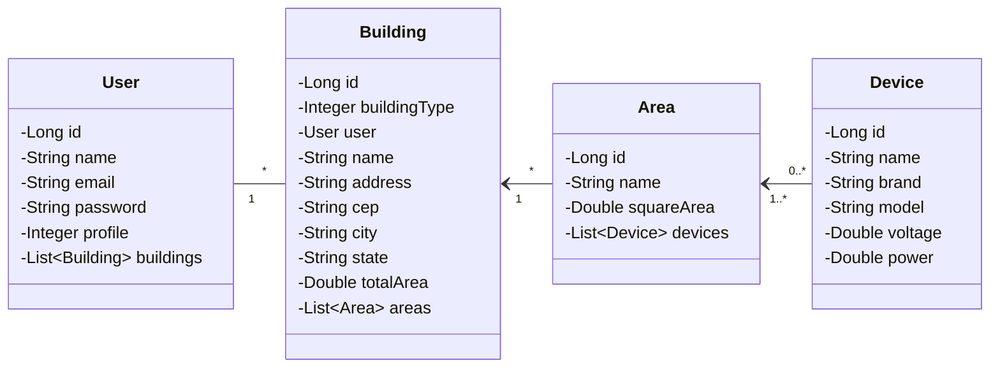
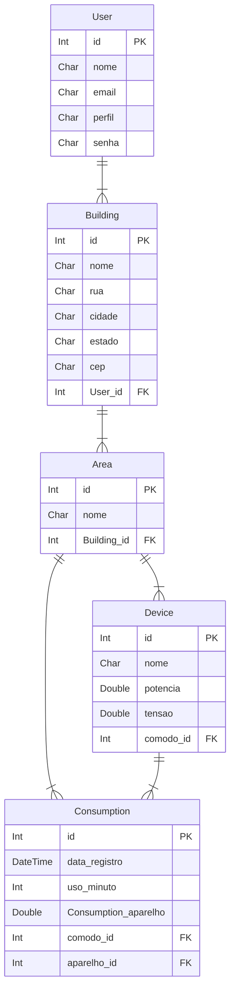

# Lumitrack

## Introdução

Projeto desenvolvido para o 2º semestre do curso de Análise e Desenvolvimento de Sistemas da PUC-MG.

Neste repositório será desenvolvido o back-end. O front-end por ser acessado [aqui]().

LumiTrack é uma aplicação inteligente que monitora o consumo de energia elétrica, ajudando a identificar desperdícios e otimizar os custos com soluções personalizadas.

## Tecnologias Utilizadas

    

## Controle de Versão

 

O projeto segue a seguinte convenção para o nome de branches:

- `main`: versão estável já testada do software
- `feature`: lançamento de funcionalidades do projeto
- `enhancement`: melhoria de funcionalidades do projeto
- `bug-fix`: correção de problemas no software

Para issues segue a seguinte convenção:

- `documentation`: melhorias ou acréscimos à documentação
- `bug`: uma funcionalidade encontra-se com problemas
- `enhancement`: uma funcionalidade precisa ser melhorada
- `feature`: uma nova funcionalidade precisa ser introduzida

Utilizado o Github Projetc para organização das tarefas do projeto, estruturado com as seguintes listas:

- **Backlog:** recebe as tarefas a serem trabalhadas e representa o Backlog do produto.
- **To Do:** representa as tarefas que podem ser iniciadas.
- **In progress:** tarefas iniciadas.
- **In Review:** tarefas em revisão.
- **Done:** tarefas finalizada.

## Requisitos (REVISAR E ATUALIZAR)

### Requisitos Funcionais

|ID    | Descrição do Requisito  | Prioridade |
|------|-----------------------------------------|----|
|RF-001| A aplicação deve permitir cadastro e implementação de diferentes níveis de acesso para administradores, moderador e usuários comuns. | MÉDIA |
|RF-002| A aplicação deve permitir o cadastro e autenticação dos usuários. | ALTA |
|RF-003| A aplicação deverá permitir que o usuário administrador cadastre usuário moderador, registre aparelhos e insira dados contendo nome, tensão e potência. | MÉDIA |
|RF-004| A aplicação deverá permitir que o usuário moderador registre aparelhos e insira dados contendo nome, tensão e potência. | MÉDIA |
|RF-005| O usuário comum deve ser capaz de solicitar a inclusão de novos aparelhos a usuários moderadores ou administradores. | BAIXA |
|RF-006| A aplicação deve permitir o registro de múltiplas edificações com dados como localização, área total, e tipo de uso (residencial, comercial etc.). | ALTA |
|RF-007| A aplicação deve permitir cadastrar e vincular cômodo à edificação correspondente. | ALTA |
|RF-008| A aplicação deve permitir cadastrar e vincular aparelhos em cada cômodo. | ALTA |
|RF-009| O sistema calculará o consumo total de energia para cada edificação, somando os consumos de cada cômodo e aparelhos existentes. | ALTA |
|RF-010| A aplicação deve manter um histórico de consumo detalhado, permitindo revisões e análises ao longo do tempo. | MÉDIA |
|RF-011| A aplicação deve fornecer dashboards para visualização de dados de consumo em gráficos, tabelas, permitindo que o usuário visualize quais áreas da casa consomem mais energia. | BAIXA |
|RF-012| A aplicação deve permitir comparar o histórico de consumo com valores de potência e tensão predefinidos por usuário administrador ou moderador para aparelhos, tendo como base datas definidas pelo usuário. | MÉDIA |
|RF-013| A aplicação deve permitir que o usuário simule o valor total da conta de luz ao fim do mês, com base no consumo total de energia registrado ou simulado, e no valor do kWh fornecido pelo usuário. | ALTA |
|RF-014| A aplicação deve permitir avaliar a eficiência energética com base nos dados coletados e oferecer sugestões como a substituição de equipamentos ou a alteração de horários de uso. | BAIXA |
|RF-015| A aplicação deve permitir criar relatórios automáticos que mostram padrões de consumo, ineficiências e sugestões de melhoria. | MÉDIA |
|RF-016| A aplicação deve permitir a exportação de dados e relatórios em formato CSV. | BAIXA |

### Requisitos Não Funcionais

|ID     | Descrição do Requisito  |Prioridade |
|-------|-------------------------|----|
|RNF-001| A interface deve ser intuitiva, permitindo que usuários sem conhecimento técnico possam navegar e utilizar as funcionalidades com facilidade. | ALTA |
|RNF-002| A aplicação deve ser acessível em diferentes dispositivos (desktop, tablets, smartphones). |  MÉDIA |
|RNF-003| O código deve ser modular e documentado para facilitar a manutenção e futuras atualizações. |  ALTA |
|RNF-004| A aplicação deve ser compatível com os principais navegadores (Google Chrome, Firefox, Microsoft Edge). |  ALTA |
|RNF-005| A aplicação deve ser desenvolvido seguindo boas práticas e convenções de codificação em C#. |  BAIXA |
|RNF-006| A aplicação deve incluir medidas básicas de segurança |  BAIXA |

## Arquitetura da Solução

### Diagrama de Classes (REVISAR E ATUALIZAR)

## Modelo ER (Projeto Conceitual) (REVISAR E ATUALIZAR)

## Projeto da Base de Dados (REVISAR E ATUALIZAR)

## Teste da API

1. Abra o Postman.
2. Envie as requisições para os endpoints da API.
    - **Usuários:**
        - `GET /users` Lista todos os usuários.
        - `GET /users/{id}` Lista o usuário pelo id informado.
        - `POST /users`: Cadastra um novo usuário.
        - `PUT /users/{id}`: Atualiza as informações do usuário com id informado.
        - `DELETE /users/{id}`: Deleta usuário através do id informado.
    - **Edificações:**
        - `GET /buildings` Lista todas as edificações.
        - `GET /buildings/{id}` Lista a edificação pelo id informado.
        - `POST /buildings/user/{userId}`: Cadastra uma nova edificação vinculado a um usuário específico.
        - `PUT /buildings/user/{userId}/building/{buildingId}`: Atualiza as informações da edificação com id informado de um usuário específico.
        - `DELETE /buildings/user/{userId}/building/{buildingId}`: Deleta a edificação com id informado de um usuário específico.
    - **Areas**
        - `GET /areas` Lista todas as áreas.
        - `GET /areas/{id}` Lista a área pelo id informado.
        - `POST /areas/building/{buildingId}`: Cadastra uma nova área vinculada a uma edificação específica.
        - `PUT /areas/building/{buildingId}/area/{areaId}`: Atualiza as informações da área com id informado de uma edificação específica.
        - `DELETE /areas/building/{buildingId}/area/{areaId}`: Deleta a área com id informado de uma edificação específica.
    - **Aparelhos**
        - `GET /devices` Lista todos os aparelhos.
        - `GET /devices/{id}` Lista o aparelho pelo id informado.
        - `POST /devices/area/{areaId}`: Cadastra um novo aparelho vinculado a uma área específica.
        - `PUT /devices/area/{areaId}/device/{deviceId}`: Atualiza as informações do aparelho com id informado de uma área específica.
        - `DELETE /devices/area/{areaId}/device/{deviceId}`: Deleta o aparelho com id informado de uma área específica.
